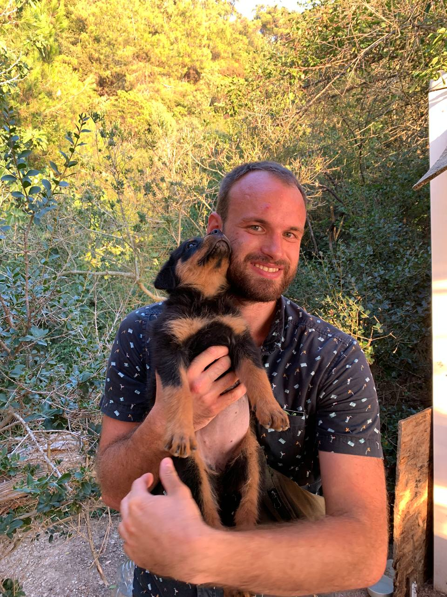

# Обо мне 

Учился в матшколах, закончил МГУ. Преподавал: в кружках Малого Мехмата, летних матлагерях. Работал разработчиком в Яндекс Поиске. Составитель вступительных экзаменов во ВШЭ

# Олимпиады (<a href="/olympiads/">Олимпиады</a>)
Там всякие школьные олимпиады, фотофки
Победитель и призер разного уровня олимпиад по Математике и Физике

# Обучение (<a href="/teaching/">Обучение</a>)
Чему я обучаю и способен обучить.
Школьная матеша, олимпиадки, подготовка к ЕГЭ. 
Программа вуза по математике
Обучение программированию на Python. Олимпиадная математика

ToDo: куда-то впихнуть дипломчик